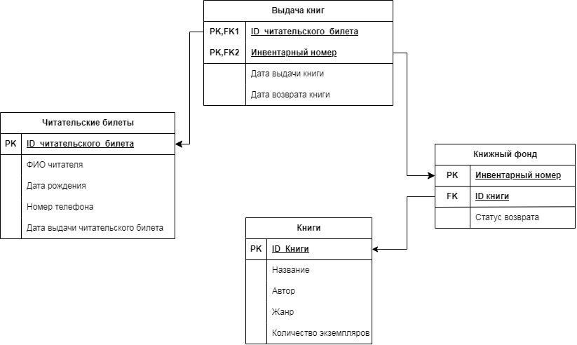

# База данных "Читательский билет"

Данный проект представляет собой реляционную базу данных для автоматизации учёта книг и читателей в библиотеке.
Система реализована на СУБД MySQL и включает бизнес-логику с использованием триггеров для автоматического контроля книг, отслеживания пропущенных сроков сдачи книг читателями и управлением состояния книжного фонда.

## Схема базы данных 

База состоит из основных 4 таблиц, связанных между собой:
* library_ticket - информация о читателях и их билетах.
* books - книжный фонд библиотеки.
* stock_books - информация о каждом физическом экземпляре книги.
* given_books - журнал выдачи и возврата книг читателям.

**Схема базы данных**



## Функциональные возможности

* Регистрация читателей и книг.
* Автоматический учёт выданных книг с помощью триггеров.
* Контроль лимитов:
    * Стандартный лимит: 5 книг на руках у читателя.
    * Лимит уменьшается до 3 книг при наличии просроченных сдач.
    * Лимит восстанавливается до 5 книг после своевременного возврата последних 3 книг.
* Автоматическая проверка доступности книги перед выдачей.
* Отслеживание сроков возврата и автоматическое присвоение статуса ("Возвращена вовремя"/"Возвращена не вовремя").

## Установка и развертывание

В директории database находятся два файла: 
* database_dump.sql хранит структуру базы данных, триггеров и тестовые данные.
* database_structure.sql хранить лишь структуру, без данных.

1.  Откройте командную строку или терминал.
2.  Перейдите в папку, куда сохранили файл `database_dump.sql`.
3.  Выполните команду, заменив `[username]` на ваше имя пользователя MySQL (например, `root`):

    ```bash
    mysql -u [username] -p -D library_tickets < database/database_dump.sql
    ```
4.  Введите пароль от вашего MySQL-сервера когда появится запрос.
5.  Готово! Скрипт выполнится, и БД будет развернута. 

### Проверка установки

Чтобы убедиться, что всё работает корректно, выполните простой запрос в вашем MySQL-клиенте:

```sql
use library_tickets;
select * from library_ticket limit 3;
```
В результате вы должны увидеть список первых трёх читателей из таблицы.

## Примеры использования

После развёртывания вы можете опробовать работу триггеров и выполнить примеры запросов из проекта.

**Пример 1.**

Попробуем выдать книгу, которая уже на руках у другого читателя
```sql
insert into given_books (g_id, g_num, g_given) values (1002, 100001, '2024-03-24');
```
Должна возникнуть ошибка "Проверьте инвентарный номер книги. Эта книга уже выдана другому читателю."

**Пример 2.**

Запрос на топ-5 популярных книг в библиотеке (по количеству выдач читателям).
```sql
select b_name, count(*) as number_of_issues
from stock_books sb
join given_books gb on sb.s_num = gb.g_num join books b on sb.s_id = b.b_id
group by b.b_id
order by number_of_issues desc
limit 5;
```
